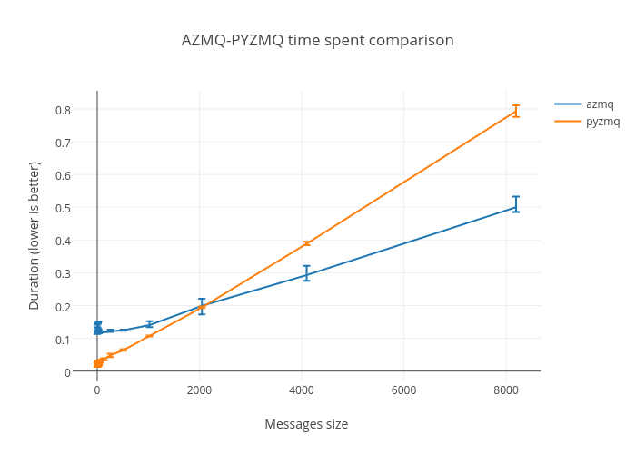

# AZMQ

**AZMQ** is a Python 3 asyncio-native implementation of [ZMTP](http://rfc.zeromq.org/spec:37) (the protocol behind ZMQ).

## Motivation

None of the existing Python ZMQ implementation currently implements a fully
functional asyncio-compatible version that works well on all platforms. This is
especially true on Windows for which the few existing implementations are
seriously limited in performance or functionality, and some require the use of
a specific event-loop, which prevents using the default, standard ones.

**AZMQ**'s goal is to lift those restrictions and to work the same on all
platforms that Python 3.5 supports by providing a pure asyncio-native
implementation.

## Current state and goals

**AZMQ** is currently **NOT** in a production-ready state. The code has not
been thoroughly performance-tested let alone optimized. This will come later.

The main focus at the moment is to provide support for (checked items are
implemented already):

- All socket types:
  * [x] REQ
  * [x] REP
  * [x] DEALER
  * [x] ROUTER
  * [x] PUB
  * [x] XPUB
  * [x] SUB
  * [x] XSUB
  * [x] PUSH
  * [x] PULL
  * [x] PAIR

- Those transports:
  * [x] TCP client
  * [x] TCP server
  * [x] Inproc
  * [ ] UNIX sockets

- Those mechanisms:
  * [x] NULL
  * [x] PLAIN
  * [x] CURVE
  * [ ] ZAP

Also, the intended API tries to be close to the one of pyzmq, but not too
close. Here is an **non-exhaustive** list of some differences in the APIs:

- **AZMQ** methods never take a `timeout` parameter. In the asyncio world, you
  just use
  [`asyncio.wait_for()`](https://docs.python.org/3/library/asyncio-task.html#asyncio.wait_for)
  for that purpose.
- There is no
  [`Poller`](http://learning-0mq-with-pyzmq.readthedocs.io/en/latest/pyzmq/multisocket/zmqpoller.html)
  class. The asyncio event-loop already gives you everything you need in terms
  of "polling" several ZMQ sockets at the same time. Actually, it's better
  because you are not limited to ZMQ sockets.

## Performances

AZMQ is fairly recent and only a few benchmarks where made to assert his (in)effectiveness.

Here is a graph that shows the time spent by AZMQ and the reference
implementation (pyzmq) when sending a bunch of messages of different sizes and
waiting for a reply for each of those, over a LAN. The time spent by the
generation of the messages or to establish the various connections is **NOT**
contained in these measurements. Only the sending and receive of messages.

Details about the methodology can be found in the [benchmark](benchmark) folder.

    

For a full-size, interactive version of the graph, [click
here](https://plot.ly/~ereOn/18/azmq-pyzmq-time-spent-comparison/) thanks to
[`plot.ly`](https://plot.ly).

From the benchmark, it seems that `azmq` is greatly outperformed (by a factor
of 10) for small messages by `pyzmq`. This is no surprise provided that:

- `azmq` is a pure Python library. `pyzmq` is a Python wrapper around the official `libzmq`, a C library.
- `azmq` was never optimized as of now.
- For small messages, which usually take less time to send on the wire, the
  overhead of pure Python code is more significant and thus, noticeable. In
  affine functions terms, **the `azmq` graph has a bigger constant**.

However, it seems for bigger messages, `azmq` takes less time than `pyzmq`.
This could be explained by the fact that messages are carried by reference
inside all of `azmq` because those almost never leave the Python realm.

For some weird reason, using `copy=False` in `pyzmq` results in the worst of
both worlds.

**Theories for those results or insights on the benchmark methodology are
welcome**. The goal is not to lie about the library's performance, quite the
opposite.

## Installation

There is not official package available just yet but once there is, follow
these instructions:

---

You may install it by using `pip`:

> pip install azmq
